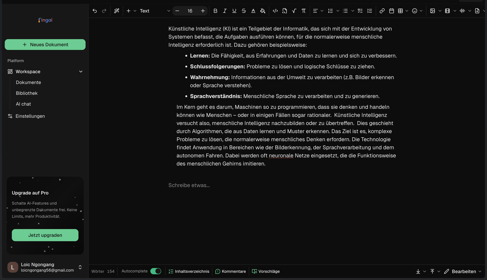
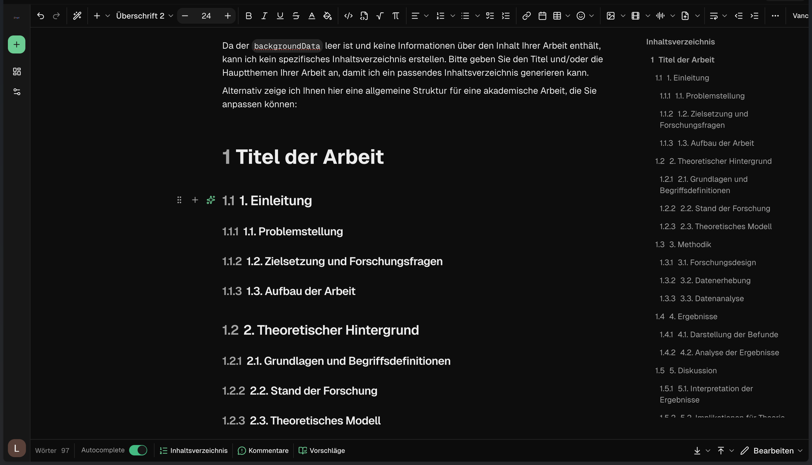
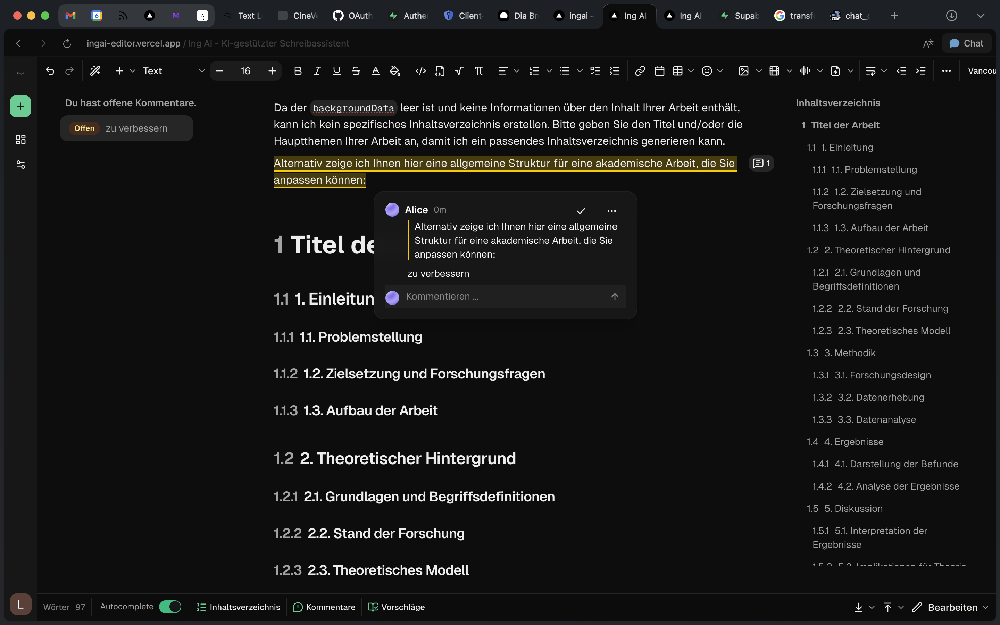

<div align="center">
  <a href="https://ingai-editor.xyz/">
    
  </a>
  <br />
  <br />
  <a href="README.de.md"></a>
  <a href="README.md"></a>
  <br />
  <br />
    <a href="https://ingai-editor.xyz/">
      
    </a>
  <br />

  <p align="center">
    <strong>The next-gen platform for academic writing.</strong>
    <br />
    <span style="color: #666;">Open Source ⸱ AI-Native ⸱ Collaborative</span>
  </p>

  <p align="center">
    <a href="https://ingai-editor.xyz/"><strong>📱 Live App</strong></a> •
    <a href="#features">Features</a> •
    <a href="#tech-stack">Stack</a> •
    <a href="#getting-started">Setup</a>
  </p>

  <div align="center">
    
    
    
    
    
  </div>
</div>

<br />

<div align="center">
  <div style="display: flex; justify-content: center; gap: 10px; margin-bottom: 20px;">
    <a href="https://ingai-editor.xyz/" target="_blank">
      
    </a>
    <a href="https://ingai-editor.xyz/" target="_blank">
      
    </a>
    <a href="https://ingai-editor.xyz/" target="_blank">
      
    </a>
  </div>
</div>

<br />

---

## 🔮 Vision

**Ing AI** revolutionizes the academic writing process. Inspired by Jenni.ai, it offers an environment that accompanies students and researchers from initial research to final export. We combine the power of **LLMs (Deepseek)**, a massive database of scientific sources (>250M papers), and a state-of-the-art editor.

---

## ⚡ Features

### Advanced AI & Agents

<div align="center">
  
</div>

**Context-Aware Autocomplete**  
The AI understands the context of your work and logically continues your sentences – as if it were reading your mind.

**Specialized Agents**  
*   **Bachelor & Master Agent:** A guided workflow for your thesis (Topic finding → Outline → Writing phase).
*   **AskJenni:** Chat directly with your library. *"Summarize the methodology of Source X"* or *"Find counterarguments"*.

**Smart Commands**  
Highlight text and transform: *Rewrite*, *Shorten*, *Simplify*, or *Make Academic*.

---

### Scientific Engine

<div align="center" style="margin: 20px 0;">

| Metric | Source Coverage |
| :--- | :--- |
| **Databases** | Access to **>20** databases (CrossRef, OpenAlex, PubMed, arXiv) |
| **Index** | Search in over **250 million** scientific articles |
| **Styles** | Support for **>9000** citation styles (APA, Harvard, IEEE) via CSL |

</div>

**Citation Management**  
Automatic bibliography generation in real-time. Add a source, and the bibliography updates immediately.

**Research Library**  
Central management of PDFs, notes, and metadata. BibTeX Import & Export for full compatibility.

---

### Pro Editor

We use [Plate.js](https://platejs.org/docs) for an unbeatable editing experience.

**Format Flexibility**  
Import and export in all relevant formats:
*   **Input:** Markdown, HTML, BibTeX
*   **Output:** DOCX (Word), HTML, Markdown, LaTeX, PDF

**TextLive Math**  
Write formulas naturally in the flow. Type `/mat` or syntax like `\sum`:
*   *Inline:* $E=mc^2$
*   *Block:* Full LaTeX Equation environment

---

### Realtime Collaboration

**Sync Engine**  
Conflict-free, simultaneous editing in Google Docs style (powered by Yjs).

**Presence & Review**  
Live cursors show team activity. Use comments and suggestion mode (Track Changes) for professional feedback.

---

## 🛠 Tech Stack

This stack defines the standard for modern AI web apps in 2025.

| Scope | Technology | Usage |
|-------|------------|-------|
| **Framework** | Next.js 16 | App Router, Server Actions |
| **Styling** | Tailwind 4 | + Shadcn/ui & Framer Motion |
| **Editor** | Plate.js | Headless WYSIWYG Framework |
| **Database** | Supabase | Postgres, Auth, Realtime, Vector |
| **AI Layer** | Deepseek | High-Performance LLM Integration |

---

## 🏁 Getting Started

### Prerequisites
*   Node.js 18+ (pnpm recommended)
*   Supabase Account
*   Deepseek API Key

### Installation

1.  **Clone Repository**
    ```bash
    git clone https://github.com/your-username/ing-ai.git
    cd ing-ai
    ```

2.  **Install Dependencies**
    ```bash
    npm install
    ```

3.  **Environment Setup**
    ```bash
    cp ENV_TEMPLATE.md .env.local
    # Enter your API Keys in .env.local
    ```

4.  **Database Migration**
    Run the SQL script `supabase/schema.sql` in the Supabase Dashboard.

5.  **Run Dev Server**
    ```bash
    npm run dev
    ```
    Visit: `http://localhost:3000`

---

## 📍 Roadmap

*   [x] **Core Editor**: Markdown, LaTeX, Realtime Sync (Yjs)
*   [x] **AI Engine**: Deepseek Autocomplete & Chat Agents
*   [x] **Citations**: >9000 Styles, >20 Databases, BibTeX Support
*   [x] **Exports**: DOCX, HTML, Markdown
*   [ ] **Mobile**: Native Mobile App
*   [ ] **Plagiarism**: External Plagiarism Scanner APIs Integration
*   [ ] **Offline**: Local-First Sync Architecture

---

## 📄 License

This project is licensed under the Apache License 2.0 - see the [LICENSE](LICENSE) file for details.

---

<div align="center">
  <small>Built with ❤️ by Francloic & Community.</small>
</div>
